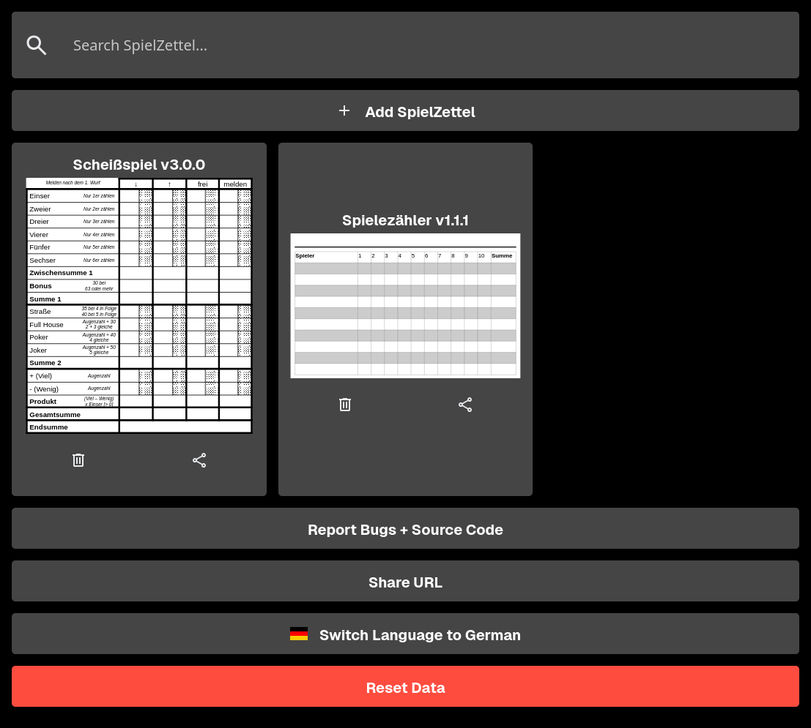
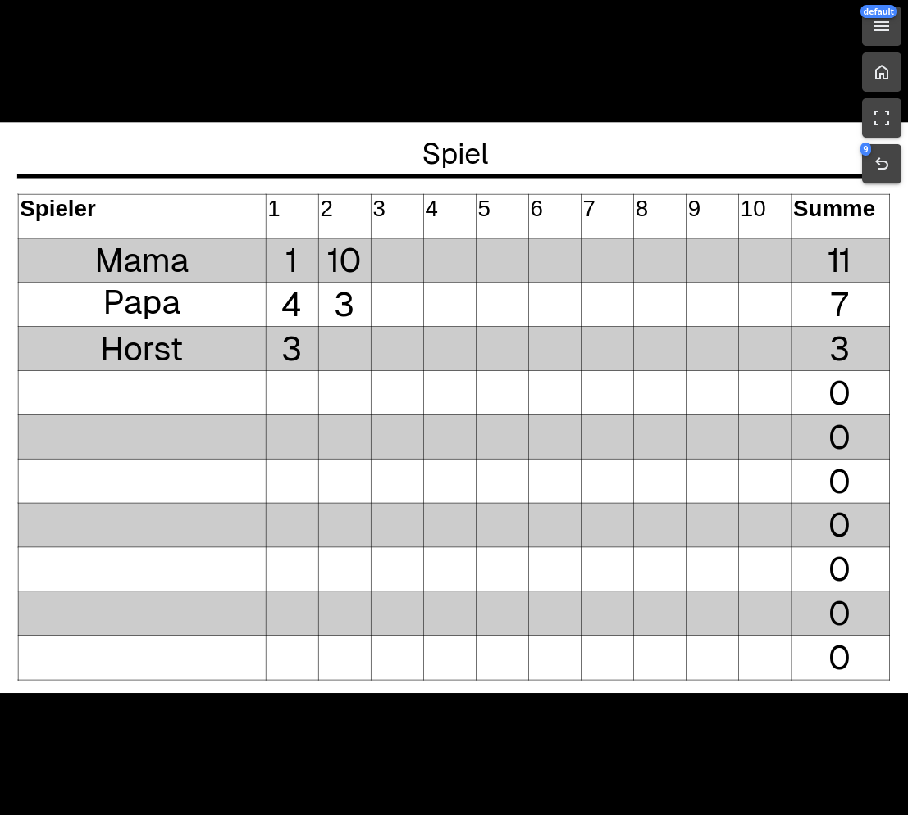
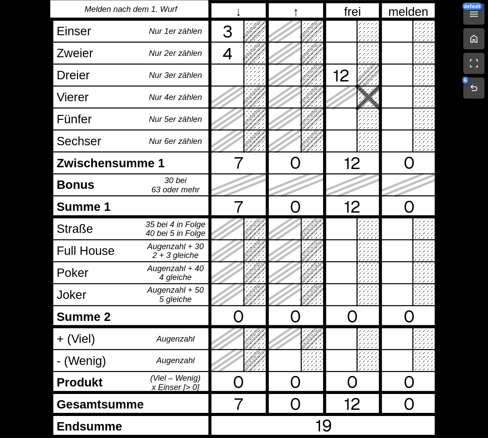

# SpielZettel

- Load game papers (German: *Spiel Zettel*) that contain:
  - an image (`.svg`, `.png`, `.jpg`, ...)
  - a description of elements (text/number input, checkboxes) on that image (`.json`)
  - **optionally** contain a ruleset to automatically generate e.g. number values based on the current inputs
- Edit elements on top of the image (and automatically calculate sums etc.)
- If you close the app/website the inputs are saved for later
- It's easy to share screenshots of the current input state using the context menu
- For QoL there is a home, fullscreen, undo and redo button

Technology:

- Progressive Web App that when built can be hosted anywhere (no runtime required, only HTML + JS)
- Stores data locally in the web browser

## Examples

On the home screen you can **add** SpielZettel or **search**, **select**, **delete** and **share** imported SpielZettel.

It is also possible to share the website to someone else you want to play with or reset all (local) data.

### Spielzähler

With this SpielZettel you can for example track multiple rounds of a game to see who won across all of them.

The default rules allow you to automatically calculate the sum across each row over a maximum of 10 rounds.

### Scheißspiel

A spin on dice games where you throw 5 dice and can depending on where you still have a free cell (and conforming to their descriptions) add up the dice eye count of the matching dice with sometimes additional points.

The default rules allow you to automatically calculate the sum across each column and across all of them.

